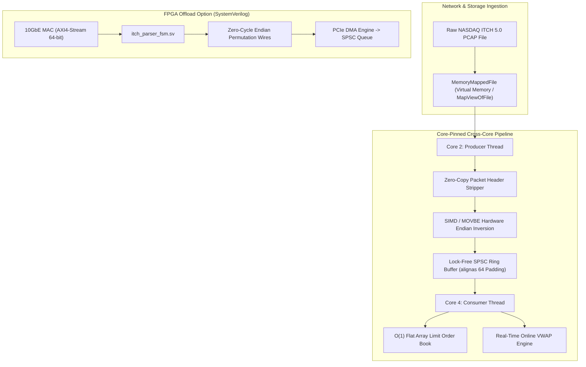
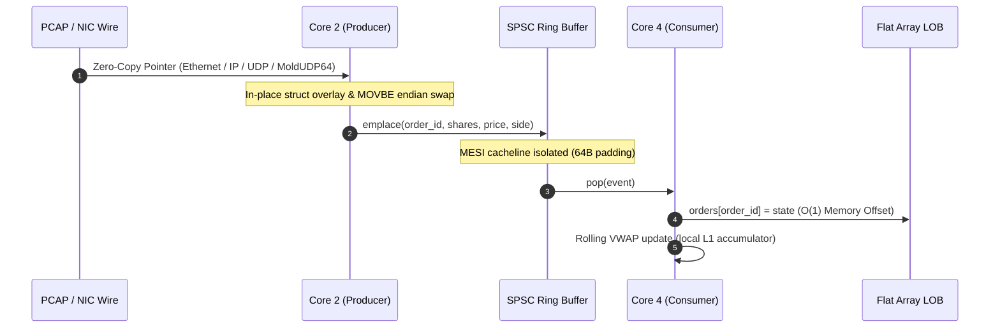
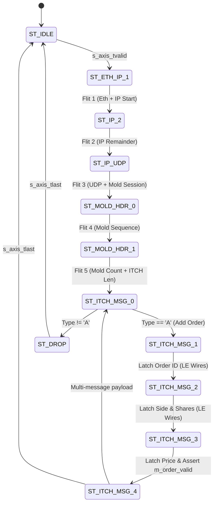

# Kestrel: Wire-Speed NASDAQ ITCH 5.0 PCAP Engine (C++20 / SIMD / SystemVerilog)

[](https://en.cppreference.com/w/cpp/20)
[]()
[]()
[]()

An ultra-low latency, zero-copy, memory-mapped NASDAQ TotalView-ITCH 5.0 order book engine, PCAP parser, and SystemVerilog FPGA parser core. Built to bypass OS kernel overhead, minimize cache thrashing, and process raw network streams at wire speed.

---

## Performance Benchmarks

Measured on raw multi-gigabit PCAP packet streams with live Limit Order Book state reconstruction and online signal tracking:

| Mode | Throughput | Latency / Msg | Execution Details |
| :--- | :--- | :--- | :--- |
| **Single-Threaded Apex** | **207.48 M msg/sec** | **~4.82 ns** | In-place zero-copy parsing + direct-indexed flat array |
| **Two-Thread SPSC Pipeline** | **86.35 M msg/sec** | **~11.58 ns** | Core-pinned producer-consumer with live online VWAP signal |

```text
=== [MODE 1] SINGLE-THREADED APEX BENCHMARK ===
[+] Single-Threaded Best Time:       0.0096394 s
[+] Single-Threaded Peak Throughput: 207.482 M msg/sec

=== [MODE 2] TWO-THREAD SPSC PIPELINE (PARSER -> ALPHA ENGINE) ===
[+] SPSC Messages Processed:        2000000
[+] SPSC Pipeline Elapsed:          0.0231611 s
[+] SPSC Cross-Core Throughput:     86.3517 M msg/sec
[+] Consumer Real-Time VWAP Metric: 180.03
```

---

## Architecture & Data Flow



---

## Detailed Pipeline Breakdown



---

## Architectural Highlights

### 1. Zero-Copy Memory Mapping (`mmap` / `MapViewOfFile`)
No user-to-kernel copies via `fread` or `std::ifstream`. The raw capture file is mapped directly into virtual address space via Win32 `CreateFileMapping` / `MapViewOfFile` (`FILE_FLAG_SEQUENTIAL_SCAN`) and POSIX `mmap` (`POSIX_MADV_SEQUENTIAL`, `MADV_HUGEPAGE`), eliminating kernel page thrashing.

### 2. Struct Overlays & Strict Packing
Network framing (Ethernet, IPv4, UDP, MoldUDP64, ITCH 5.0) is overlaid via pointer casting onto `#pragma pack(push, 1)` contiguous layout structures without intermediate deserialization.

### 3. SIMD & Hardware MOVBE Endianness Inversion
NASDAQ ITCH integer fields are broadcast Big-Endian over the wire. Kestrel vectorizes endian reversal using unaligned vector loads, hardware `MOVBE` instructions, and SSSE3/AVX2 vector shuffles (`_mm_shuffle_epi8`), swapping multi-field identifiers, quantities, and prices concurrently.

### 4. Direct Flat-Array Order Book ($O(1)$ Memory Offset)
Eliminates dynamic node allocations, tree traversals, and `std::unordered_map` hash bucketing. NASDAQ 64-bit Order Reference Numbers map directly to a contiguous, pre-allocated memory slab for deterministic cache-friendly lookups. Top-of-book levels are tracked branchlessly with explicit compiler branch prediction weights (`[[unlikely]]`).

### 5. False-Sharing-Immune SPSC Lock-Free Ring Buffer
To bridge network ingestion and the alpha engine across physical cores:
- Ring buffer storage is sized to powers of two with bitwise mask indexing.
- Producer and consumer atomic positions are isolated on independent cache lines using `alignas(64)` padding to prevent MESI bus invalidation storms.
- Producer pinned to physical Core 2; consumer pinned to physical Core 4 via OS affinity masks (`SetThreadAffinityMask` / `pthread_setaffinity_np`).

### 6. SystemVerilog AXI4-Stream Hardware Core (`hardware/`)
Includes a synthesizable line-rate hardware parser FSM targeting 10GbE / 25GbE FPGA SmartNIC MAC interfaces:
- Ingests 64-bit AXI4-Stream flits clocked at 322.26 MHz.
- Real-time hardware header stripping across Ethernet, IPv4, UDP, and MoldUDP64.
- Zero-cycle endianness transformation using physical wire routing.
- Validated testbench provided in `hardware/tb_itch_parser_fsm.sv`.

---

## Hardware State Machine (FPGA)



---

## Directory Layout

```text
Kestrel/
├── include/
│   └── kestrel/
│       ├── affinity.hpp        # OS thread CPU core pinning
│       ├── endian.hpp          # SIMD vector byte shuffles & MOVBE helpers
│       ├── itch.hpp            # ITCH 5.0 and MoldUDP64 wire structures
│       ├── mmap.hpp            # OS virtual memory-mapped file wrapper
│       ├── order_book.hpp      # Direct-mapped flat array Limit Order Book
│       ├── parser.hpp          # Zero-copy framing and ITCH dispatch
│       ├── pcap.hpp            # Packed PCAP, Ethernet, IPv4, UDP framing
│       └── spsc_queue.hpp      # Cacheline-padded lock-free ring buffer
├── src/
│   └── main.cpp                # Dual-mode synthetic benchmark harness
├── hardware/
│   ├── itch_parser_fsm.sv      # Synthesizable AXI4-Stream ITCH parser FSM
│   └── tb_itch_parser_fsm.sv   # SystemVerilog testbench harness
├── CMakeLists.txt              # C++20, -O3, -flto, -mavx2 build pipeline
└── README.md
```

---

## Build & Run

### Prerequisites
- C++20 compliant compiler (Clang 16+, GCC 12+, MSVC 2022)
- CMake 3.20+
- Ninja or Make

### Compilation
```bash
cmake -B build -G "Ninja" -DCMAKE_CXX_COMPILER=clang++ -DCMAKE_BUILD_TYPE=Release
cmake --build build --config Release
```

### Execution
```bash
# Run internal synthetic benchmark generator (2,000,000 messages)
./build/kestrel_bench

# Or run against an external recorded NASDAQ ITCH PCAP file
./build/kestrel_bench /path/to/capture.pcap
```
