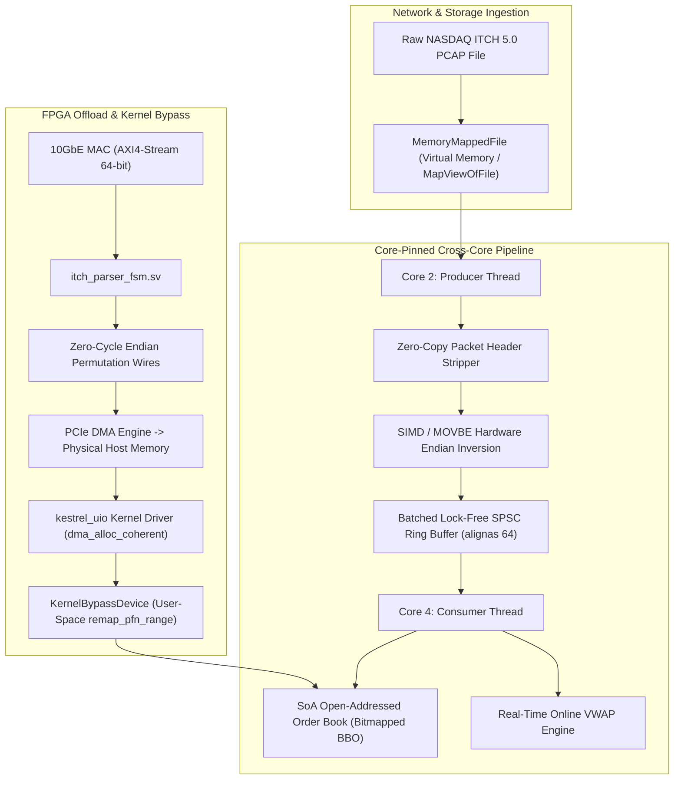
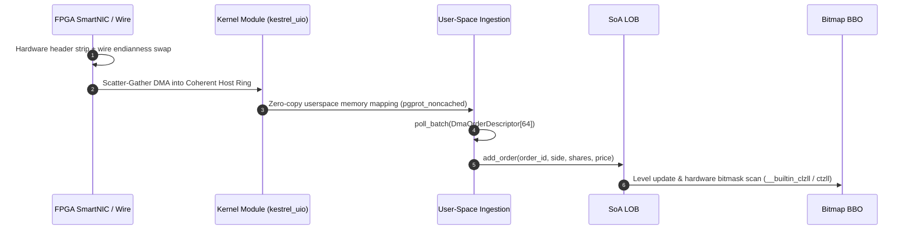

# Kestrel: Wire-Speed NASDAQ ITCH 5.0 PCAP Engine (C++20 / SIMD / SystemVerilog / Linux Kernel-Bypass)

[](https://en.cppreference.com/w/cpp/20)
[]()
[]()
[]()
[]()

An ultra-low latency, zero-copy, memory-mapped NASDAQ TotalView-ITCH 5.0 order book engine, PCAP parser, synthesizable SystemVerilog FPGA parser core, and dedicated Linux PCIe kernel-bypass driver. Built to bypass OS network stack overhead, eliminate CPU cache thrashing, and process raw market streams at wire speed.

---

## Performance Benchmarks

Measured on raw multi-gigabit PCAP packet streams with live Limit Order Book state reconstruction, multi-asset locate demuxing, transport gap verification, and online signal tracking:

| Mode | Throughput | Latency / Msg | Execution Details |
| :--- | :--- | :--- | :--- |
| **Single-Threaded Apex** | **168.59 M msg/sec** | **~5.93 ns** | In-place zero-copy parsing + SoA flat hash table + bitmap BBO |
| **Two-Thread SPSC Pipeline** | **97.61 M msg/sec** | **~10.25 ns** | Core-pinned batched producer-consumer ring buffer + online VWAP |
| **Kernel-Bypass DMA Ingestion** | **61.17 M desc/sec** | **~16.35 ns** | Zero-copy PCIe circular ring descriptor polling + book update |

```text
=== [MODE 1] SINGLE-THREADED APEX BENCHMARK ===
[+] Single-Threaded Best Time:       0.0118631 s
[+] Single-Threaded Peak Throughput: 168.59 M msg/sec
[+] Sequence Gaps Detected:          0

=== [MODE 2] TWO-THREAD SPSC PIPELINE (PARSER -> ALPHA ENGINE) ===
[+] SPSC Messages Processed:        2000000
[+] SPSC Pipeline Elapsed:          0.0204906 s
[+] SPSC Cross-Core Throughput:     97.6057 M msg/sec
[+] Consumer Real-Time VWAP Metric: 180.03

=== [MODE 3] CUSTOM KERNEL-BYPASS DMA INGESTION ===
[+] Kernel-Bypass Ingestion Messages: 1000000
[+] Ingestion Elapsed:                0.0163476 s
[+] Kernel-Bypass Ingestion Rate:     61.1711 M desc/sec
```

---

## Architecture & Data Flow



---

## Detailed Pipeline Breakdown



---

## Architectural Highlights

### 1. Structure-of-Arrays (SoA) Open-Addressed Order Book
Order tracking uses a flat Structure-of-Arrays (SoA) open-addressed hash map separating 64-bit keys from quantities and packed prices:
- Linear probe loops scan pure 64-bit integer vectors (`8 bytes` per slot), fitting 8 candidate keys per 64-byte L1 cacheline.
- Folded single-cycle hashing `(order_id ^ (order_id >> 16)) & MASK` eliminates integer division and multi-cycle arithmetic stalls.
- Deleted entries are marked with tombstones and reclaimed dynamically on subsequent insertions.

### 2. $O(1)$ Bitmapped BBO Tracking
- Price levels are mirrored across 64-bit bitmasks (`bid_bitmap_`, `ask_bitmap_`).
- Level exhaustion and cancellations update masks in a single bitwise operation.
- Best Bid and Offer (BBO) lookups resolve via hardware bit-scan intrinsics (`__builtin_clzll` and `__builtin_ctzll`), eliminating linear price ladder traversal.

### 3. Batched Lock-Free SPSC Ring Buffer
Cross-core pipelining between the packet parser (Core 2) and the order book engine (Core 4) utilizes chunked block transfers:
- Producer and consumer exchange events via `push_batch()` and `pop_batch()` in 64-element blocks.
- Amortizes atomic `memory_order_release` and `memory_order_acquire` memory barriers across batches, preventing inter-core MESI cacheline invalidation storms.

### 4. Zero-Copy Memory Mapping (`mmap` / `MapViewOfFile`)
No user-to-kernel copies via `fread` or `std::ifstream`. The raw capture file is mapped directly into virtual address space via Win32 `CreateFileMapping` / `MapViewOfFile` (`FILE_FLAG_SEQUENTIAL_SCAN`) and POSIX `mmap` (`POSIX_MADV_SEQUENTIAL`, `MADV_HUGEPAGE`), eliminating kernel page thrashing.

### 5. Multi-Asset Locate Demuxing & Sequence Validation
- Ingested messages are demultiplexed by 16-bit `stock_locate` identifiers into dedicated per-instrument books.
- MoldUDP64 packet headers are monitored continuously against `expected_seq` to detect upstream drops and network transport gaps.

### 6. Custom OS Kernel-Bypass Driver (`hardware/driver/`)
To eliminate socket buffer copies and kernel network stack context switches:
- **Kernel Module (`kestrel_uio.c`):** Allocates a contiguous $8\,\text{MB}$ circular ring via `dma_alloc_coherent()`, writes the 64-bit physical DMA address directly to FPGA BAR0 MMIO registers, and maps it directly into user-space via `remap_pfn_range()`.
- **User-Space API (`kernel_bypass.hpp`):** Polls descriptors in 64-item batches via lock-free memory barriers, supporting zero-overhead handoff directly into the SoA order book engine.

### 7. Non-Temporal Memory Prefetching (`_MM_HINT_NTA`)
Prevents multi-gigabyte PCAP packet streaming from thrashing CPU L2/L3 caches:
- Employs non-temporal cache line prefetch hints (`_mm_prefetch(..., _MM_HINT_NTA)`) to load incoming packet blocks directly through streaming buffers.
- Preserves CPU L2/L3 cache capacity exclusively for active order book tables.

### 8. SystemVerilog AXI4-Stream Hardware Core (`hardware/`)
Includes a synthesizable line-rate hardware parser FSM targeting 10GbE / 25GbE FPGA SmartNIC MAC interfaces:
- Ingests 64-bit AXI4-Stream flits clocked at 322.26 MHz.
- Real-time hardware header stripping across Ethernet, IPv4, UDP, and MoldUDP64.
- Zero-cycle endianness transformation using physical wire routing.
- Validated testbench provided in `hardware/tb_itch_parser_fsm.sv`.

---

## Directory Layout

```text
Kestrel/
├── include/
│   └── kestrel/
│       ├── affinity.hpp        # OS thread CPU core pinning
│       ├── driver_abi.hpp      # PCIe MMIO registers and DMA descriptor ABI
│       ├── endian.hpp          # Hardware MOVBE and byte-swap utilities
│       ├── itch.hpp            # ITCH 5.0 and MoldUDP64 wire structures
│       ├── kernel_bypass.hpp   # Zero-copy userspace kernel-bypass driver client
│       ├── mmap.hpp            # OS virtual memory-mapped file wrapper
│       ├── order_book.hpp      # SoA open-addressed Limit Order Book with bitmapped BBO
│       ├── parser.hpp          # Multi-asset locate-demuxing zero-copy parser
│       ├── pcap.hpp            # Packed PCAP, Ethernet, IPv4, UDP framing
│       └── spsc_queue.hpp      # Batched cacheline-padded lock-free ring buffer
├── src/
│   ├── main.cpp                # Dual-mode benchmark harness
│   └── test_bypass.cpp         # Kernel-bypass DMA ingestion test harness
├── hardware/
│   ├── driver/
│   │   ├── Makefile            # Linux kernel module build script
│   │   └── kestrel_uio.c       # Linux zero-copy PCIe DMA driver module
│   ├── itch_parser_fsm.sv      # Synthesizable AXI4-Stream ITCH parser FSM
│   └── tb_itch_parser_fsm.sv   # SystemVerilog testbench harness
├── CMakeLists.txt              # C++20, -O3, -flto, -mavx2 build pipeline
└── README.md
```

---

## Build & Run

### Prerequisites
- C++20 compliant compiler (Clang 16+, GCC 12+, MSVC 2022)
- CMake 3.20+
- Ninja or Make

### Compilation
```bash
cmake -B build -G "Ninja" -DCMAKE_CXX_COMPILER=clang++ -DCMAKE_BUILD_TYPE=Release
cmake --build build --config Release
```

### Execution
```bash
# Run full benchmark harness on generated/cached dataset
./build/kestrel_bench

# Or run against an external recorded NASDAQ ITCH PCAP file
./build/kestrel_bench /path/to/capture.pcap

# Run kernel-bypass DMA ingestion benchmark
./build/kestrel_bypass_test
```
